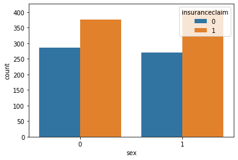
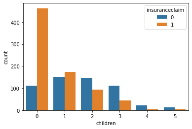
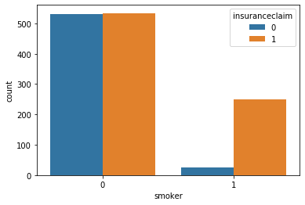
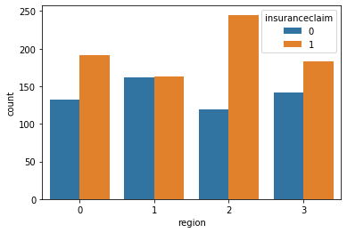
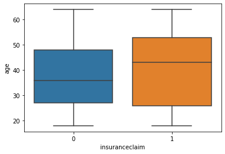
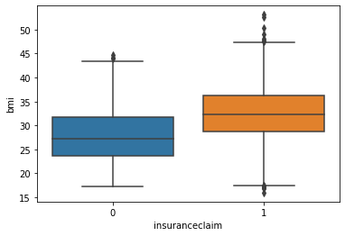
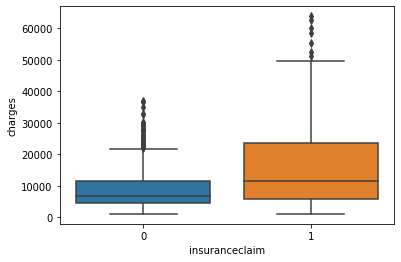

# Insurance_Claim

## Problem statement

Predict wheather a person will claim for insurance or not.

## About Dataset

<table>
  <tr>
  <th>Feature</th>
  <th>Info</th>
  </tr> <tr>
  <td>Age</td>
  <td>Age of the person</td>
  </tr>
   <tr>
  <td>Sex</td>
  <td>Gender of the person</td>
  </tr>
   <tr>
  <td>BMI</td>
  <td>Body mass index of the person</td>
  </tr>
</table>

## EDA

### Categorical features vs target

### Numerical featires vs target

